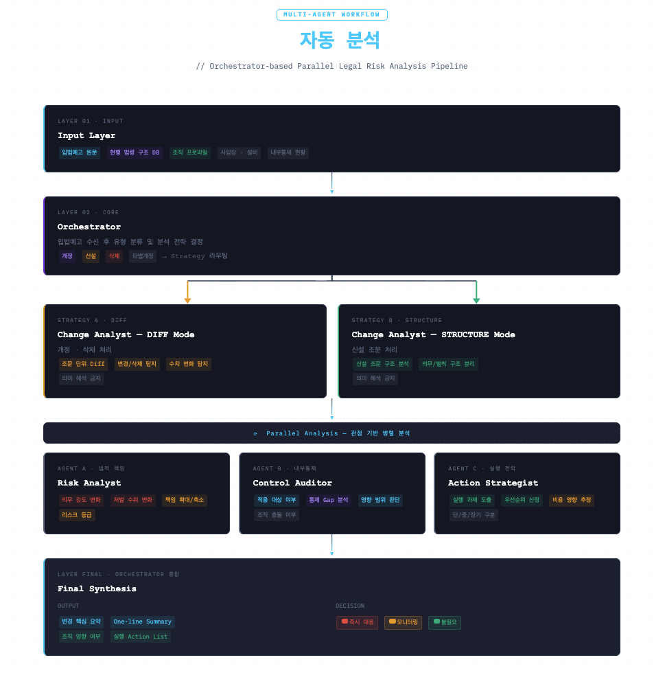

## 0) 공통 전제 및 설계 원칙

- **분석 범위(기본 PoC):**
    - 국가/권역: **대한민국 법령 중심 PoC** (확장 고려: 미국/주법 등)
    - 도메인: **안전·보건·환경·시설 관련 법규**
    - 단위:
        - 입력 1건(입법예고 텍스트/JSON/PDF) → “현행 법령”과 비교 → 영향/액션 도출
        - 조문(Article) 단위 정밀 비교 + 조직 적용성 판단
    - 제외(초기): 로그/감사/사내 시스템 연동 자동화(운영 PoC에서 단계적 도입)
- **권한/안전 원칙(중요):**
    - 법령 원문/현행 DB/사내 프로파일/내부통제 데이터는 **조회 및 비교만 수행**
    - “내부 규정/프로세스 자동 개정”, “법률 자문 대체” 금지(정책 고정)
- **관점 기반 분리(Reasoning Perspective):**
    - **Fact(구조/변경 사실)** → **Risk(법적 책임/리스크)** → **Control(내부통제/적용대상)** → **Action(실행전략)** 결과를 Orchestrator가 통합
    - “팩트(변경점)와 해석(의미/대응)을 분리”하여, 변경 사실을 먼저 고정한 뒤 관점별 분석을 병렬화
- **응답 품질 목표(KPI 지향):**
    - 처리 시간: **입법예고 분석 평균 5분 이내**
    - 조문 매칭 정확도/변경 탐지 재현율/유형 분류 정확도 등 KPI를 별도 측정
    - 출력은 “결론 + 근거 + 다음 행동(권고)”를 고정 구조로 생성
- **안전 문구(고정 정책 문구):**
    - 모든 응답 하단에 다음 문구를 고정:
        - **“참고 정보이며 자동 변경은 수행하지 않습니다(법률 자문 대체 X). 최종 판단과 책임은 사용자에게 있습니다.”**


```markdown
┌──────────────────────────────────────────────────────────────┐
│                          Input Layer                         │
│  - 입법예고 원문                                                │
│  - 현행 법령 구조 DB                                            │
│  - 조직 프로파일 (사업장, 설비, 내부통제 현황 등)                      │
└───────────────────────────────┬──────────────────────────────┘
                                ▼
┌──────────────────────────────────────────────────────────────┐
│                        Orchestrator                          │
│  - 입법예고 수신                                                │
│  - 유형 분류 (개정 / 신설 / 삭제)                         │
│  - Strategy 결정                                              │
└───────────────┬───────────────────────────────┬──────────────┘
                │                               │
                │                               │
      ┌─────────▼─────────┐           ┌────────▼─────────┐
      │   개정 / 삭제       │           │       신설        │
      │  (DIFF Strategy)  │           │ (STRUCTURE Strategy)│
      └─────────┬─────────┘           └────────┬─────────┘
                │                               │
                ▼                               ▼
      ┌────────────────────┐         ┌────────────────────┐
      │  Change Analyst    │         │  Change Analyst    │
      │   [DIFF Mode]      │         │  [STRUCTURE Mode]  │
      │  - 조문 단위 Diff    │         │  - 신설 조문 구조 분석  │
      │  - 변경/삭제 탐지     │         │  - 의미 해석 금지      │    
      │  - 수치 변화 탐지     │         └─────────┬──────────┘
      │  - 의미 해석 금지     │                   │
      └─────────┬──────────┘                   │           
                │                              │           
                └───────────────┬──────────────┘
                                ▼
              ┌────────────────────────────────┐
              │        Parallel Analysis       │
              │      (관점 기반 병렬 분석)         │
              └───────────────┬────────────────┘
                              │
        ┌─────────────────────┼─────────────────────┐
        ▼                     ▼                     ▼
┌───────────────┐   ┌────────────────┐   ┌──────────────────┐
│ Risk Analyst  │   │ Control Auditor│   │ Action Strategist│
│ (법적 책임 관점) │   │  (내부통제 관점)   │   │ (실행 전략 관점)    │
│ - 의무 강도 변화 │   │  - 적용 대상 여부  │   │ - 실행 과제 도출    │
│ - 처벌 수위 변화 │   │  - 통제 Gap 분석  │   │ - 우선순위 산정     │
│ - 책임 확대/축소 │   │  - 영향 범위 판단  │   │ - 비용 영향 추정    │
│ - 리스크 등급   │   │  - 조직 충돌 여부  │   │ - 단/중/장기 구분   │
└───────────────┘   └────────────────┘   └──────────────────┘
                              │
                              ▼
┌──────────────────────────────────────────────────────────────┐
│                      Final Synthesis                         │
│                    (Orchestrator 종합)                        │
│  - 변경 핵심 요약 (One-line Summary)                            │
│  - 리스크 등급 표시                                              │
│  - 조직 영향 여부 명확화                                          │
│  - 대응 필요성 판단 (즉시/모니터링/불필요)                            │
│  - 실행 Action List 정리                                       │
└──────────────────────────────────────────────────────────────┘
```



- **Multi-Agent 구조**
기능 단위가 아닌 **관점(Reasoning Perspective)** 기반 책임 분리

- **Orchestrator**
    **역할**
    
    - 입법예고 입력 수신
    - 개정 / 신설 / 삭제 유형 판단
    - Agent 호출 전략 분기
        - 개정 / 삭제인 경우 Change Analyst Mode : `DIFF`
        - 신설인 경우 Change Analyst Mode : `STRUCTURE`
    - 각 Agent 결과 수집 및 종합
    - 최종 리포트 생성
    
    **특징**
    
    - 추론은 최소화
    - 워크플로우 제어 중심
    - 상태 관리 담당
- **Change Analyst (법령 구조 전문가)**
    
    **역할**
    
    - 조문 단위 diff 생성
    - 신설 / 삭제 / 변경 부분 식별
    - 숫자·기한·빈도 변경 탐지
    - 의미 해석 금지
    - 법적 판단 금지
    
    이 Agent는 “팩트 기반 구조 분석”만 수행하고, 의미 해석은 하지 않는다.
    
    ```bash
    제23조 제2항
    1년 → 6개월
    변경 유형: 빈도 증가
    ```
    
- **Risk Analyst Agent(법적 책임 관점 전문가)**
    
    입력:
    
    - Change Analyst 결과
    
    역할:
    
    - 의무 강도 변화 분석
    - 처벌 수위 변화 탐지
    - 법적 책임 확대/축소 판단
    - 리스크 등급 산정
    
    이 Agent는 “법적 책임 관점”만 보고, 조직 상황은 고려하지 않는다.
    
    ```bash
    의무 빈도 2배 증가
    불이행 시 과태료 유지
    관리 부담 증가
    리스크 등급: Medium
    ```
    
- **Control Auditor Agent(조직 내부통제 관점 전문가)**
    
    입력:
    
    - Change 결과
    - 조직 프로파일
    
    역할:
    
    - 적용 대상 여부 판단
    - 기존 내부 통제 체계와 충돌 여부 판단
    - Gap 분석 수행
    - 영향 범위 판단
    
    ```bash
    현재 점검 주기 연 1회
    개정 요구 반기 1회
    통제 미충족
    ```
    
- **Action Strategist Agent(실행 전략 전문가)**
    
    입력:
    
    - Risk 결과
    - Control Gap 분석
    
    역할:
    
    - 구체적 실행 항목 도출
    - 우선순위 설정
    - 예상 비용 영향 추정
    
    ```bash
    1. 점검 매뉴얼 수정 (High)
    2. 교육 주기 변경 (Medium)
    3. 예산 재산정 필요
    ```
---

## 1) Agent 페르소나 및 시스템 프롬프트 (Identity)

### 1.1 Orchestrator Agent

| 항목 | 정의 내용 |
| --- | --- |
| Agent 이름 | `LegisGuard-Orchestrator` |
| 주요 역할 | 입력(텍스트/JSON/PDF)을 수신하고 **문서 유형/개정 유형/대상 법령**을 식별한 뒤, 필요한 에이전트를 호출하여 **공통 State**에 누적하고 **단일 리포트**로 종합 |
| 핵심 목표 | “입법예고를 넣으면 ①무엇이 바뀌었고 ②우리 조직에 영향이 있고 ③무엇을 해야 하는지”가 한 번에 나오는 수준 |
| 톤앤매너 | 단정적·보고서형. **Fact → Risk → Control → Action** 순서. 불확실하면 “미확인/추정/추가 확인 필요” 명시 |
| 제약 사항 | 1) 법률 자문 단정 금지 2) 근거 없는 해석 금지 3) 원문 범위를 넘어선 임의 추론/창작 금지 4) 자동 변경/실행 지시 금지 |

**Orchestrator System Prompt(핵심 문구 예시)**

- 당신은 “입법예고 영향 분석” 오케스트레이터이다.
- 입력을 `doc_type`(text/json/pdf), `change_type`(개정/신설/삭제/타법개정), `target_law`로 분류하고, 에이전트를 최소 호출로 라우팅한다.
- 모든 결과는 `LegisState`에 누적하고, 최종 출력은 **Fact → Risk/Control → Action**으로 구성한다.
- 조회 실패/근거 부족은 숨기지 말고 “조회 불가(사유)”로 출력한다.
- 법률 자문 대체를 하지 않으며, 자동 변경을 수행하지 않는다.

---

### 1.2 Change Analyst Agent (Fact / 구조·변경점)

| 항목 | 정의 내용 |
| --- | --- |
| Agent 이름 | `LegisGuard-ChangeAnalyst` |
| 주요 역할 | 입법예고안과 현행 법령을 **조문 단위로 정밀 매칭**하고, **신설/삭제/문구 변경/수치·기한·빈도 변화**를 구조적으로 추출 |
| 핵심 목표 | “무엇이 어떻게 바뀌었는지”를 **팩트로 고정** |
| 톤앤매너 | 기계적·객관적. 변경 전/후, 조문 위치, 변경 유형 라벨 중심 |
| 제약 사항 | 1) 의미 해석 금지 2) 법적 판단 금지 3) 조직 적용성 판단 금지(다른 에이전트 영역) |

> Change Analyst는 “조문 Diff 생성 및 변경 유형 식별”만 수행하고 의미 해석을 제한하는 구조가 핵심입니다.
> 

**Change Analyst System Prompt(핵심 문구 예시)**

- 당신은 “법령 구조 분석” 에이전트다.
- 조문/항/호 단위로 매칭하고 Diff를 생성하라.
- 숫자/기한/빈도 등 **정량 변화**를 별도 필드로 추출하라.
- 의미 해석 문장을 생성하지 말고, 팩트만 출력하라.

---

### 1.3 Risk Analyst Agent (Risk / 법적 책임 관점)

| 항목 | 정의 내용 |
| --- | --- |
| Agent 이름 | `LegisGuard-RiskAnalyst` |
| 주요 역할 | Change Analyst 결과를 입력으로 받아 **의무 강도 변화/처벌 수위/책임 범위 확대·축소**를 평가하고 리스크 등급 산정 |
| 핵심 목표 | “법적 리스크 관점에서 이 변경이 위험한가?”를 일관된 기준으로 등급화 |
| 톤앤매너 | 근거 중심(조문/벌칙 연계). 등급은 High/Medium/Low + 사유 |
| 제약 사항 | 1) 조직 상황(설비/사업장) 고려 금지(통제 에이전트 영역) 2) 확정적 법률 자문 금지 |

> Risk Analyst는 “법적 책임 관점”만 보고 리스크를 매깁니다.
> 

---

### 1.4 Control Auditor Agent (Control / 내부통제·적용대상)

| 항목 | 정의 내용 |
| --- | --- |
| Agent 이름 | `LegisGuard-ControlAuditor` |
| 주요 역할 | Change 결과 + 조직 프로파일(사업장/설비/위험물/관리체계) + 내부통제 현황을 비교하여 **적용 대상 여부**, **통제 Gap**, **영향 범위(전사/사업장)** 도출 |
| 핵심 목표 | “우리 조직에 실제로 영향이 있는가? 현재 통제가 충족되는가?”를 명확히 |
| 톤앤매너 | 체크리스트형. 충족/미충족/정보부족 라벨링 |
| 제약 사항 | 1) 법적 리스크 최종 판정 금지(리스크 에이전트 결과를 참조만) 2) 내부 데이터 없으면 ‘추정’ 대신 ‘추가 필요’로 표시 |

> Control Auditor는 적용 대상/통제 Gap 중심 분석을 수행합니다.
> 

---

### 1.5 Action Strategist Agent (Action / 실행 전략)

| 항목 | 정의 내용 |
| --- | --- |
| Agent 이름 | `LegisGuard-ActionStrategist` |
| 주요 역할 | Risk 등급 + Control Gap을 입력으로 받아 **실행 과제(Action List)**, 우선순위, 단·중·장기 구분, 담당 부서 제안 |
| 핵심 목표 | “무엇부터 무엇을 해야 하는지”를 실행 가능한 업무 단위로 전환 |
| 톤앤매너 | 업무 지시서처럼 명확(작업명/산출물/담당/기한/의존성) |
| 제약 사항 | 1) 실제 내부 규정 자동 수정 금지 2) 비용/일정은 근거 없이 단정 금지(범위로 표현) |

---

## 2) 워크플로우 및 오케스트레이션 (Workflow & Logic)

### 2.1 처리 로직

### Step 1) Input Analysis (입력 분석/정규화)

Orchestrator가 입력을 다음 순서로 분해합니다.

1. **입력 타입 판별**
    - `doc_type = text` : 입법예고 원문 텍스트
    - `doc_type = json` : 국민참여입법센터/수집 파이프라인 JSON
    - `doc_type = pdf` : 입법예고 PDF(첨부문서)
2. **대상 법령/문서 메타 추출**
    - 법령명, 소관부처, 입법예고 기간, 시행예정일, 개정 구분(일부개정/전부개정/신설/타법개정 등)
    - 추출 실패 시 “메타 미확인”으로 표시하고 후속 단계에서 보강 검색
3. **개정 유형 분류(Strategy 선택)**
    - `change_type = amend/delete` → `ChangeAnalyst.mode = DIFF`
    - `change_type = new` → `ChangeAnalyst.mode = STRUCTURE`
        
        (신설은 “구조 파악”이 우선이기 때문에 Diff 전략과 분기)
        
4. **의도 분류(Intent)**
    - `impact_report` : “영향 분석 리포트 만들어줘”
    - `diff_only` : “변경점만 뽑아줘”
    - `control_gap` : “우리 내부통제 기준에서 갭이 뭐야?”
    - `action_plan` : “실행 과제만 정리해줘”
    - `mixed` : 위 다중

---

### Step 2) Tool Selection (최소 호출 전략)

- `diff_only`
    - Change Analyst만 호출
    - 도구: 현행 법령 조회 + 조문 매칭 + diff
- `impact_report` (기본)
    - Change Analyst → (병렬) Risk Analyst + Control Auditor → Action Strategist → Synthesis
    - 도구: 현행 법령 구조 DB, Vector DB(RAG), 조직 프로파일/통제 현황 조회
- `control_gap`
    - Change Analyst + Control Auditor 중심
    - Risk는 옵션(리스크 등급이 우선순위 판단에 필요할 때만)
- `action_plan`
    - Risk + Control 결과가 있어야 품질이 나와서, 없으면 최소 분석을 먼저 수행

---

### Step 3) Execution & Response (통합/충돌 해결/출력)

1. Agent 결과를 `LegisState`에 누적
2. 충돌 해결 우선순위
    - **Fact(ChangeAnalyst)가 최우선:** “무엇이 바뀌었는가”는 단일 진실원(Single Source of Truth)
    - **Risk가 다음:** 법적 리스크 등급/사유
    - **Control이 다음:** 적용대상/갭/영향 범위
    - **Action이 마지막:** 실행 과제(우선순위/기한/담당)
3. 최종 출력 포맷(고정)
    - `[Fact]` 변경 요약 + 변경 조문 리스트 + Diff 하이라이트
    - `[Risk]` 리스크 등급 + 근거(의무/벌칙/책임 변화)
    - `[Control]` 적용 대상 여부 + Gap + 영향 범위
    - `[Action]` 실행 과제(단기/중기/장기) + 산출물/담당 제안
    - `주의:` 고정 안전 문구

---

### 2.2 상태 관리 (LangGraph State / Node / Edge)

### LegisState

- `session_id: str`
- `tenant: str = "AmorePacific"`
- `input: { doc_type, raw_text, raw_json, pdf_ref, metadata }`
- `intent: enum`
- `target: { country, law_id, law_name, ministry, effective_date? }`
- `facts: { matched_articles[], diffs[], numeric_changes[], missing_links[] }`
- `risk: { level, drivers[], penalty_links[], notes[] }`
- `control: { applicability, affected_sites[], gaps[], evidence[] }`
- `action: { items[], priority_map, timeline, owners[] }`
- `rag: { queries[], chunks[] }`
- `tool_audit: { calls[], failures[], latency_ms[] }`
- `final_answer: str`

### LangGraph Node 구성

- `N0: input_router` (입력 타입/메타 추출)
- `N1: change_type_classifier` (개정/신설/삭제/타법개정)
- `N2: change_analyst_node` (DIFF or STRUCTURE)
- `N3: risk_analyst_node` (조건부)
- `N4: control_auditor_node` (조건부)
- `N5: action_strategist_node` (조건부)
- `N6: synthesizer` (통합/충돌 해결/리포트 생성)
- `N7: guardrails` (법률자문 고지, 자동변경 금지, 근거 누락 점검)

### Edge 규칙(요약)

- `N0 → N1 → N2`
- `N2 → (N3 || N4)` 병렬
- `(N3, N4) → N5 → N7 → N6`
- `diff_only`면 `N2 → N7 → N6`로 단축

---

## 3) 도구(Tools) 및 함수 명세 (Capability)

| 도구명 (Function Name) | 기능 설명 | 입력 파라미터 (Input Schema) | 출력 데이터 (Output) |
| --- | --- | --- | --- |
| `ingest_legis_notice` | 입법예고 입력 수신(텍스트/JSON/PDF) 및 표준화 | `doc_type`, `payload`, `metadata?` | `normalized_doc` |
| `parse_notice_structure` | 입법예고 문서에서 법령명/개정유형/조문 후보 추출 | `normalized_doc` | `extracted:{law_name, change_type, article_candidates[]}` |
| `lawdb_get_current_law` | 현행 법령 조회(법령ID, 시행일 기준 최신) | `law_id or law_name`, `as_of_date?` | `law:{structure, articles[]}` |
| `lawdb_get_article` | 조문 단위 조회(조/항/호) | `law_id`, `article_no`, `as_of_date?` | `article_text, meta` |
| `diff_generate_article` | 조문 단위 Diff 생성(문장/토큰 기반) | `before_text`, `after_text`, `mode` | `diff:{segments[], highlights[], numeric_changes[]}` |
| `classify_change_labels` | 변경 유형 라벨링(신설/삭제/강화/완화/기한변경 등) | `diff` | `labels[]` |
| `vector_search_law` | Vector DB 기반 유사 조문/맥락 검색(RAG) | `query`, `top_k`, `filters?` | `chunks[]` |
| `profile_get_org_context` | 조직 프로파일/사업장/설비/위험물/통제 현황 조회 | `tenant`, `site_filters?` | `org_context` |
| `control_gap_analyze` | 적용대상/통제갭 분석(규정 요구 vs 현상) | `changes`, `org_context` | `gaps[], applicability, affected_scope` |
| `risk_score_evaluate` | 의무/벌칙/책임 변화 기반 리스크 등급 산정 | `changes`, `rag_chunks?` | `risk:{level, drivers, references}` |
| `action_plan_generate` | 리스크+갭 기반 실행과제 생성/우선순위 | `risk`, `gaps`, `org_policies?` | `action_items[]` |
| `report_render` | 최종 리포트 렌더링(요약/표/섹션 고정) | `LegisState` | `final_report_md or html` |

---

## 4) 지식 베이스 및 메모리 전략 (Context & Memory)

### 4.1 RAG 전략(핵심)

- **참조 데이터 소스(우선순위)**
    1. **법제처 Open API/자체 수집 현행 법령 데이터**(조문 단위)
    2. **법령 구조 DB(법→장→절→조 계층, 시행일 기준 버전 관리)**
    3. **법령 Vector DB(조문 단위 임베딩 + 메타데이터)**
    4. (확장) 내부 통제 문서/매뉴얼/점검표/교육자료(사내 문서 RAG)
- **에이전트별 RAG 사용 원칙**
    - Change Analyst: RAG 최소화(오탐 방지). 매칭 실패 시 “유사 조문 후보 탐색” 정도만 허용
    - Risk Analyst: 벌칙/책임/의무 정의 문맥 탐색에 RAG 적극 활용
    - Control Auditor: 적용대상 요건(조건 문구)과 조직 데이터 매핑에 RAG + 구조DB 병행
    - Action Strategist: 사내 정책/운영 기준을 넣으면 품질이 크게 상승(가능하면 단계 2에서 도입)

### 4.2 청킹/임베딩/메타데이터

- 청킹 단위: “조문 1개”를 기본으로 하되, 긴 조문은 항/호 기준 분절
- 메타데이터:
    - `law_id`, `law_name`, `article_no`, `paragraph_no`, `effective_date`, `ministry`, `penalty_tag`, `topic_tag`
- 임베딩:
    - 한국어 법령 특성(용어 반복/구문 길이)을 고려해 조문 단위 + 키프레이즈(의무/금지/벌칙) 보강 텍스트를 함께 임베딩

### 4.3 대화 메모리(세션) 전략

- 기본: “요약 + 윈도우 버퍼” 혼합
    - 최근 N턴 원문 유지
    - 그 이전은 `LegisState` 요약만 보존(대상 법령/결론/리스크/갭/액션)
- 저장 대상:
    - 사용자가 지정한 “사업장/설비/통제 기준”
    - 반복 분석하는 “핵심 법령 목록”과 필수 체크포인트
- 리셋 조건:
    - 국가/법령 도메인 전환, 또는 새 프로젝트 세션 시작 시

---

## 5) 핵심 에이전트 기술 스택

| 구분 | 선정 전략/기술 | 선정 사유 |
| --- | --- | --- |
| LLM Model | 고정확(분석/리포트) + 저비용(라우팅/요약) 2-tier | 라우팅 비용 절감, 분석 품질 유지 |
| Agent Framework | LangGraph | 조건부 라우팅, State 누적, 병렬 분석에 적합 |
| Prompt Strategy | “Fact 고정 → 관점별 분석 → 근거 우선 출력” | 변경점(팩트)과 해석을 분리해 신뢰도 상승 |
| Output Parsing | Structured Output(JSON) + 고정 렌더 템플릿 | 감사/재현성/평가(KPI) 가능 |
| Monitoring | Tool Audit Log + 품질평가(매칭정확도/탐지재현율) | PoC KPI를 자동으로 측정해야 함 |

---

## 6) 에이전트별 “실제 출력 JSON” 계약(초안)

### 6.1 Change Analyst 결과 스키마(예)

```json
{
  "agent": "change_analyst",
  "target": { "law_id": "LAW-XXXX", "law_name": "산업안전보건법" },
  "change_type": "amend",
  "matches": [
    {
      "article": "제23조",
      "paragraph": "제2항",
      "before_ref": { "effective_date": "2025-01-01" },
      "after_ref": { "notice_id": "NOTICE-2026-0001" }
    }
  ],
  "diffs": [
    {
      "path": "제23조 제2항",
      "diff_summary": "점검 주기 변경",
      "numeric_changes": [
        { "field": "period", "before": "1년", "after": "6개월" }
      ],
      "highlights": [
        { "type": "replace", "before": "1년", "after": "6개월" }
      ],
      "labels": ["frequency_increase"]
    }
  ],
  "tool_audit": { "calls": ["lawdb_get_article", "diff_generate_article"] }
}
```

### 6.2 Risk Analyst 결과 스키마(예)

```json
{
  "agent": "risk_analyst",
  "risk": {
    "level": "Medium",
    "drivers": [
      "의무 이행 빈도 증가",
      "미이행 시 과태료 조항 연계 가능성"
    ],
    "references": [
      { "type": "article", "path": "제23조 제2항" },
      { "type": "rag", "chunk_id": "C-10291" }
    ]
  }
}
```

### 6.3 Control Auditor 결과 스키마(예)

```json
{
  "agent": "control_auditor",
  "applicability": "Applicable",
  "affected_scope": ["국내 생산사업장", "특정 설비군: 혼합/저장"],
  "gaps": [
    {
      "control_item": "정기 점검 주기",
      "required": "반기 1회",
      "current": "연 1회",
      "status": "Gap",
      "evidence": ["internal_policy: EHS-INSPECT-01"]
    }
  ]
}
```

### 6.4 Action Strategist 결과 스키마(예)

```json
{
  "agent": "action_strategist",
  "actions": [
    {
      "title": "점검 주기 및 체크리스트 개정",
      "priority": "High",
      "timeline": "단기(시행 전)",
      "owner_suggestion": ["안전보건팀", "공장 EHS"],
      "deliverables": ["개정 점검 SOP", "체크리스트 v2", "교육 공지"]
    }
  ],
  "notes": ["자동 변경 없음", "법률 자문 대체 아님"]
}
```